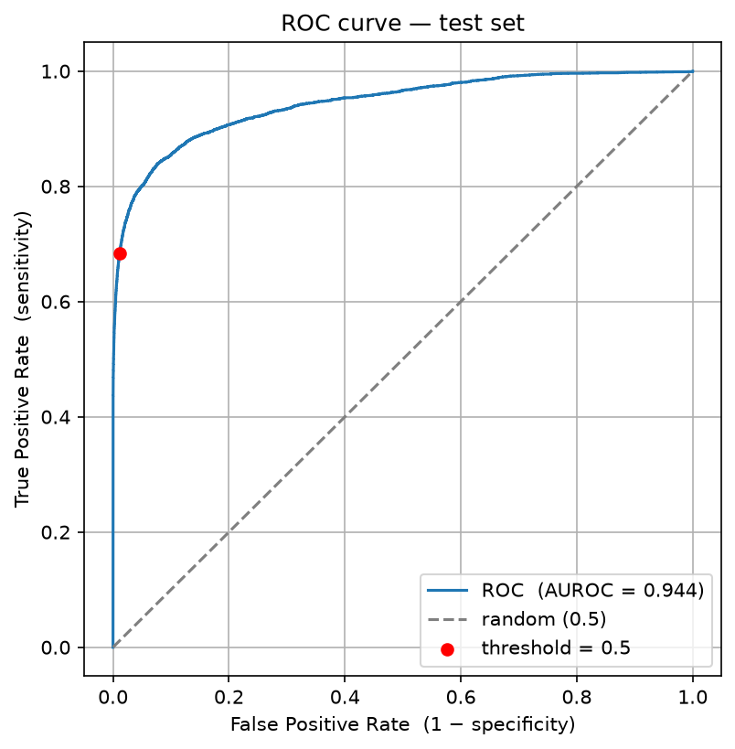
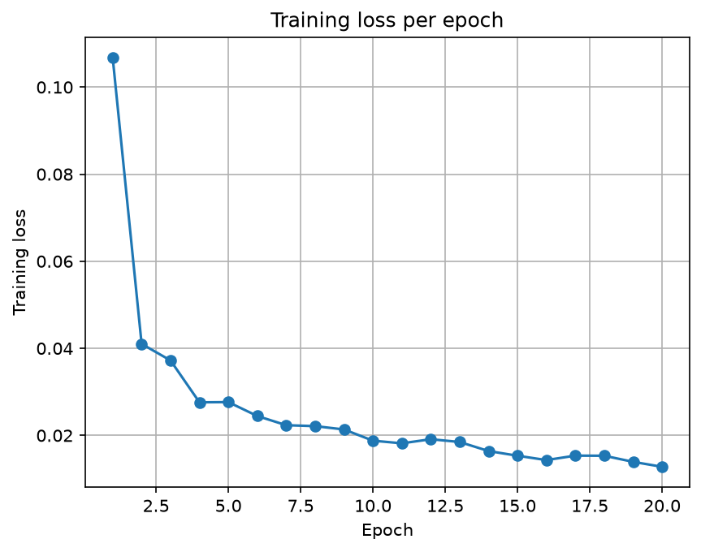

# ECG heartbeat classification — 1D CNN on MIT-BIH

A from-scratch PyTorch pipeline that classifies individual heartbeats as
**normal (N)** or **premature ventricular contraction (V)** from the
MIT-BIH Arrhythmia Database, evaluated with AUROC.

The emphasis is on doing every step *correctly* rather than chasing a high
number — most importantly, splitting the data **by recording** so that no
patient appears in both the training and test sets.

## Overview

- Reads raw ECG signal and expert beat annotations from MIT-BIH using `wfdb`
- Extracts a 180-sample window (0.5 s at 360 Hz) centred on each beat's R-peak
- Keeps only N and V beats; uses lead MLII (channel 0) only
- Splits by recording (100–200 train, 201–234 test) to prevent intra-patient leakage
- Trains a 3-block 1D CNN with `BCEWithLogitsLoss` and Adam
- Evaluates with AUROC and a ROC curve

## Project structure

```
MIT_BIH/
├── mitbih.py        # the full pipeline (VS Code # %% cells)
├── README.md
├── .gitignore
├── ecg-env/         # virtual environment   (git-ignored)
├── mitdb/           # downloaded dataset     (git-ignored)
└── .vscode/         # editor settings        (git-ignored)
```

## Setup

```bash
python -m venv ecg-env
source ecg-env/bin/activate
pip install torch wfdb numpy pandas matplotlib scikit-learn
```

## Get the data

The dataset is not committed (it is large and freely downloadable). Fetch the
48 recordings into `./mitdb` with a single command:

```bash
python -c "import wfdb; wfdb.dl_database('mitdb', dl_dir='./mitdb')"
```

## Run

Open `mitbih.py` in VS Code and run the `# %%` cells top to bottom (requires the
Python and Jupyter extensions), or run the whole file at once:

```bash
python mitbih.py
```

## Results

Test **AUROC ≈ 0.96** on the held-out 200-series recordings. The exact value
varies by a few points between runs because of random weight initialisation.
The 200-series is deliberately harder and the train/test split is
patient-separated, so the score is not inflated by leakage.



Training converged cleanly over 20 epochs:



## Design notes

- **Split by recording, not by beat.** A single patient's beats are highly
  correlated. Letting them fall into both train and test allows the model to
  memorise the patient instead of learning beat morphology, which inflates the
  apparent score. Splitting by recording is what makes the AUROC trustworthy.
- **AUROC over accuracy.** Roughly 90% of beats are normal, so a model that
  blindly predicts "normal" would reach ~90% accuracy while detecting nothing.
  AUROC measures ranking ability and is not fooled by this class imbalance.

## Data

MIT-BIH Arrhythmia Database, accessed via PhysioNet.

- Moody GB, Mark RG. *The impact of the MIT-BIH Arrhythmia Database.*
  IEEE Eng Med Biol Mag. 2001;20(3):45–50.
- Goldberger AL, et al. *PhysioBank, PhysioToolkit, and PhysioNet.*
  Circulation. 2000;101(23):e215–e220.
